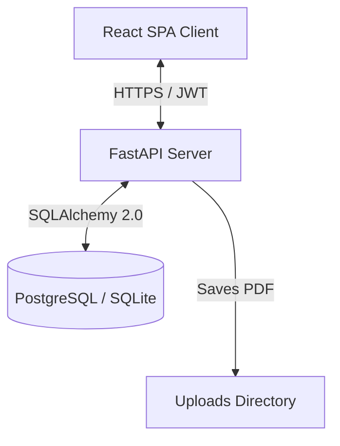

# Sravan Kumar – AI Engineer & Full Stack Developer Portfolio

This is the production-grade, official developer portfolio website for **Sravan Kumar**, a final-year B.Tech student specializing in Artificial Intelligence & Data Science. The application consists of a secure FastAPI REST API backend, a PostgreSQL/SQLite database layer, and a highly responsive React + TypeScript + Tailwind CSS (v4) frontend. It features an interactive **Admin Console Dashboard** for portfolio management.

---

## Technical Architecture Overview

The system is designed with a clean separation of concerns:

- **Frontend (client/)**: Built using **Vite + React + TypeScript + Tailwind CSS v4**. Implements smooth client-side routing with `react-router-dom`, forms validation with `react-hook-form`, dynamic icon render mappings, and a customizable Git contribution graph. Page traffic is tracked automatically via a custom pageview tracking hook.
- **Backend (server/)**: Built using **FastAPI** with **SQLAlchemy 2.0 ORM** and **Pydantic v2** validation. Utilizes JWT (JSON Web Tokens) for security and standard password hashing with `bcrypt`. Endpoints support CORS permissions.
- **Database**: Employs **PostgreSQL** in production environments and local **SQLite** for development. Tables are generated programmatically on application startup.



---

## Project Folder Structure

```
proj port/
├── client/                 # React + TypeScript Frontend
│   ├── public/             # robots.txt, sitemap.xml, assets
│   ├── src/
│   │   ├── components/     # UI components (Navbar, Footer, GitCalendar, CodingProfiles)
│   │   ├── pages/          # Home, BlogDetail, Login, AdminDashboard
│   │   ├── hooks/          # useAnalytics tracking hook
│   │   ├── services/       # api.ts (Axios), github.ts (GitHub API Client)
│   │   ├── context/        # AuthContext for JWT tokens
│   │   ├── types/          # TypeScript structural interfaces
│   │   ├── utils/          # IconRenderer utility
│   │   ├── App.tsx         # Routing configuration
│   │   ├── index.css       # Tailwind v4 configuration and imports
│   │   └── main.tsx        # React mounting entry point
│   ├── vite.config.ts      # Vite server proxies and plugins
│   └── package.json        # Frontend configuration and scripts
├── server/                 # FastAPI Backend
│   ├── app/
│   │   ├── api/            # Routers (projects, skills, education, experience, blogs, messages, resume, settings, analytics)
│   │   ├── core/           # config.py, database.py, security.py
│   │   ├── models/         # SQLAlchemy schemas
│   │   ├── schemas/        # Pydantic validation schemas
│   │   ├── main.py         # App entry point & static files configuration
│   │   └── init_db.py      # Database seeding & Admin creator script
│   ├── requirements.txt    # Python library requirements
│   ├── .env                # Local environment variables
│   └── portfolio.db        # Auto-generated SQLite Database file
└── README.md               # Architecture & setup instructions
```

---

## Getting Started

### Prerequisites
- **Node.js**: v24.0.0 or higher
- **Python**: v3.12 or higher
- **Git**

### Installation

1. **Clone the repository**:
   ```bash
   git clone <repository_url>
   cd "proj port"
   ```

2. **Setup the Backend**:
   ```bash
   cd server
   # Create a virtual environment
   python -m venv venv
   # Activate virtual environment
   # On Windows (PowerShell):
   .\venv\Scripts\Activate.ps1
   # On macOS/Linux:
   source venv/bin/activate
   
   # Install dependencies
   pip install -r requirements.txt
   
   # Copy environment configuration
   cp .env.example .env
   
   # Seed the database (creates default admin & seed data)
   python -m app.init_db
   ```

3. **Setup the Frontend**:
   ```bash
   cd ../client
   # Install dependencies
   npm install
   ```

---

## Running the Application

### Running Local Development Servers

To run the application locally, you will start the backend server and frontend development server concurrently:

1. **Start FastAPI Backend** (from `server/` with venv activated):
   ```bash
   uvicorn app.main:app --reload --port 8000
   ```
   *The interactive API Swagger docs will be available at: http://localhost:8000/docs*

2. **Start Vite React Frontend** (from `client/`):
   ```bash
   npm run dev
   ```
   *The web application will launch at: http://localhost:5173*

### Sign In to Admin Console Dashboard

- URL: http://localhost:5173/admin
- Default Username: `admin` (can be configured in `server/.env`)
- Default Password: `SravanAdmin2026!` (can be configured in `server/.env`)

---

## Database Schemas & Relations

The PostgreSQL/SQLite database layout consists of the following 13 entities:

1. **Admin**: Authenticated panel operator credentials.
2. **Projects**: Contains case studies, features list (JSON), architecture layouts, and repositories links.
3. **Skills**: Skill proficiencies, category grouping, years of experience, and project links.
4. **Education**: Degree name, college, university affiliations, CGPA, and durations.
5. **Experience**: Professional roles timeline, achievements list (JSON), and technology tags.
6. **Achievements**: Coding accolades, hackathon victories, and links.
7. **Certifications**: Professional accreditations, credential links, and skills learned (JSON).
8. **Blog**: Technical write-ups with markdown contents, read times, and slugs.
9. **Messages**: Inquiries received from the client contact form.
10. **Resume**: PDF URL path details.
11. **SocialLinks**: Link profiles (GitHub, LinkedIn).
12. **VisitorAnalytics**: Page visit tracking with hashed IP address strings and timestamps.
13. **SiteSettings**: Dynamic site configuration mappings (taglines, introductions, emails).

---

## API Documentation

Detailed Swagger specifications are available locally at `/docs` when running the backend. Major routes include:

| Method | Endpoint | Description | Auth Required |
|--------|----------|-------------|---------------|
| `POST` | `/api/auth/login-json` | Sign in to console and retrieve JWT token | No |
| `GET` | `/api/projects/` | Retrieve projects (optional `category` / `search` filters) | No |
| `POST` | `/api/projects/` | Create a new project case study | **Yes** |
| `GET` | `/api/blogs/` | Retrieve technical blog posts list | No |
| `GET` | `/api/blogs/{slug}` | Fetch blog post by route slug | No |
| `POST` | `/api/messages/` | Submit contact inquiry form | No |
| `GET` | `/api/messages/` | Retrieve contact messages list | **Yes** |
| `POST` | `/api/resume/` | Upload resume PDF file and set version | **Yes** |
| `POST` | `/api/analytics/track` | Track visitor pageview metrics | No |
| `GET` | `/api/analytics/stats` | Retrieve aggregated visitor stats report | **Yes** |

---

## Production Deployment Guide

### Backend Deployment (Render)
1. Log in to **Render** and click **New Web Service**.
2. Connect your GitHub repository.
3. Set the following details:
   - **Environment**: `Python`
   - **Build Command**: `pip install -r requirements.txt`
   - **Start Command**: `uvicorn app.main:app --host 0.0.0.0 --port $PORT`
4. Add the following environment variables in the **Environment** tab:
   - `DATABASE_URL`: Your production PostgreSQL URL (e.g. Render PostgreSQL or external).
   - `SECRET_KEY`: A strong random string for JWT signatures.
   - `ADMIN_USERNAME`: Your custom admin username.
   - `ADMIN_PASSWORD`: A secure admin dashboard password.
   - `PORT`: `10000` (Render handles this automatically).

### Database Deployment (PostgreSQL)
1. Create a PostgreSQL instance on **Render** (or Supabase/Neon).
2. Copy the external database connection string.
3. Supply this string to the backend as the `DATABASE_URL` environment variable. The SQLAlchemy migrations and table creations run automatically on app start.

### Frontend Deployment (Vercel)
1. Create a project on **Vercel** and select your repository.
2. In the configuration:
   - **Framework Preset**: `Vite`
   - **Root Directory**: `client`
   - **Build Command**: `npm run build`
   - **Output Directory**: `dist`
3. Add the following Environment Variable:
   - `VITE_API_URL`: The URL of your deployed backend on Render (e.g. `https://sravan-portfolio-backend.onrender.com/api`).
4. Click **Deploy**. Vercel will build and host the responsive web interface.
